# Introducing Minimal Videos


### Minimal videos
Objects and their parts can be visually recognized from purely spatial or purely temporal information but the 
mechanisms integrating space and time are poorly understood. Here we show that visual recognition of objects and actions 
can be achieved by efficiently combining spatial and motion cues in configurations where each source on its own is 
insufficient for recognition. This analysis is obtained by 
identifying minimal videos: these are short and tiny video clips in which objects, parts, and actions can be reliably recognized, 
but any reduction in either space or time makes them unrecognizable. Human recognition in minimal videos is invariably accompanied by 
full interpretation of the internal components of the video. State-of-the-art deep convolutional networks for dynamic recognition 
cannot replicate human behavior in these configurations. The gap between human and machine vision demonstrated here is due to critical 
mechanisms for full spatiotemporal interpretation that are lacking in current computational models. 
Dynamic figure is provided [here](figures/fig1.mp4).
### The minimal videos data summary:
|Minimal Video Type  | Minimal Video examples (Recognizable) | Spatial sub-minimal (Not recognizable)| Temporal sub-minimal (Not recognizable) | Hard negative examples (Confusing DNNs)|
|:------------------:| ------------------------------------- | ------------------------------------- | --------------------------------------- | -------------------------------------------|
| Rowing             |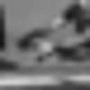, , 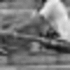       | 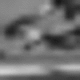, 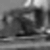, 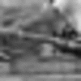 | 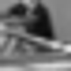, 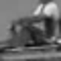, 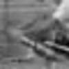 | 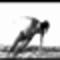, , 
| Biking             |, 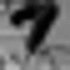, 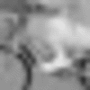       | 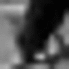, 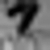, 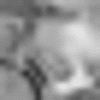| 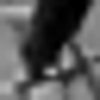, ,  |
| Playing Violin     |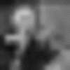, 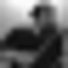,        | 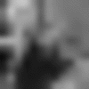, 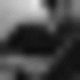, 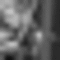 | , , 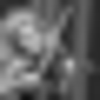|
| Mopping            |,       | 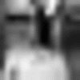, 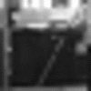      | 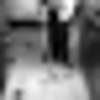, 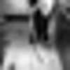|


### Data
The `raw_data` folder contains minimal video files arranged by sub-folders. 
 
Each sub-folder (e.g., ‘Mopping1’) contains:
* The folder `minimal` with a single minimal video file 
(e.g., `v_MoppingFloor_g11_c03_inds_46_51_size_19x19_rate_2_O_TL.gif`)
* The original video clip from which the minimal video was taken
(e.g., `v_MoppingFloor_g11_c03.avi` downloaded from the UCF101 dataset)
* The folder `sub_minimal` with the spatial and temporal sub-minimal versions. 
* Spatial sub-minimal files are identified by the file name suffix. The suffix indicates the type of video frame reduction:
    * BL = Bottom Left crop (e.g., `v_MoppingFloor_g11_c03_inds_46_51_size_16x16_rate_2_O_TL_BL.gif`)
    * BR = Bottom Right crop (e.g., `v_MoppingFloor_g11_c03_inds_46_51_size_16x16_rate_2_O_TL_BR.gif`)
    * TL = Top Left crop (e.g., `v_MoppingFloor_g11_c03_inds_46_51_size_16x16_rate_2_O_TL_TL.gif`)
    * TR = Top Right crop (e.g., `v_MoppingFloor_g11_c03_inds_46_51_size_16x16_rate_2_O_TL_TR.gif`)
    * scl = reduce resolution by 20% (e.g., `v_MoppingFloor_g11_c03_inds_46_51_size_16x16_rate_2_O_TL_scl.gif`)
* Temporal sub-minimal files are the two frames of the minimal video. They are identified by their frame index in the original video. 
(e.g., `v_MoppingFloor_g11_c03_TL_frame46_size_19x19.png` and `v_MoppingFloor_g11_c03_TL_frame51_size_19x19.png` to indicate the first and second frames respectively).

The file `mturk.xlsx` contains Mechanical Turk psychophysics data (recognition rate in percentage) for the minimal videos and their sub-minimal versions. 
It also contains additional details about each minimal video including frame size, frame rate, and frame index. 


### Code

##### Requirements
* pytorch 1.1 or more
* sklearn
* scikit-image
* tqdm
* tensorboard
* sacred

###### Random crop for non-class examples at minimal video style 
To generate non-class video examples used for training minimal videos classifiers run, e.g.,
```bash
python randomCrop.py -i path/to/your/video/dataset -o path/to/your/output/folder
```
where `path/to/your/video/dataset/` is a folder containing real-world videos files (e.g., videos from UCF101), and 
`path/to/your/output/folder` is a folder in which the generated video examples are saved.  

You can also run this script with additional parameters, e.g.,  
```bash
python randomCrop.py -i path/to/your/video/dataset -o path/to/your/output/folder -ns 10 -lm 400
```
where `ns` is the number of sets created to contain the negative examples (mutually excluded), and `lm` is the maximal number of generated 
negative examples.   

To extract negative video examples for specific action category at UCF101 dataset, run e.g.,
```bash
python randomCrop.py -i ucf_but_rowing -o data/minimal/negatives_video/nonrowing -ns 1 -lm 100000000 -fi 2
```
where `data/minimal/negatives_video/nonrowing` is the folder in which the negative video examples will be stored. You would also need to 
download the [UCF101 dataset](https://www.crcv.ucf.edu/data/UCF101.php) and update the ucf101 path at `CONSTS.py`.

Finally, the script for generating of negative examples includes two modes for cropping frame windows: 
a `sliding window` mode and a `selective search` mode.
To use the selective search mode (default and recommended option) clone [this repo](https://github.com/ChenjieXu/selective_search.git):
```bash
git clone https://github.com/ChenjieXu/selective_search.git
```
and update the path to your local copy at `CONSTS.py`

###### Training a video classifier
Run the `mini` option:
```bash
python train.py with mini
```

###### Evaluating classification results 
Eval on naive set:
```bash
python eval.py with weights=storage/logs/RowingOrNot/1/ResNet3D18/1/weights_RowingOrNot_ResNet3D18_best.pth
``` 
or on a small naive set:
```bash
python eval.py with weights=storage/logs/RowingOrNot/1/ResNet3D18/1/weights_RowingOrNot_ResNet3D18_best.pth subset=277
```
(notice additional flags such as `plot`)

Eval on a small hard negatives set:
```bash
python eval.py with weights=storage/logs/RowingOrNot/1/ResNet3D18/1/weights_RowingOrNot_ResNet3D18_best.pth hard
```

Eval on a set of spatial sub-minimal videos:
```bash
python eval.py with weights=storage/logs/RowingOrNot/1/ResNet3D18/9/weights_RowingOrNot_ResNet3D18_best.pth submirc
```

### Papers
If you are using this repo please cite the following paper:
* Guy Ben-Yosef, Gabriel Kreiman, and Shimon Ullman. [**Minimal videos: Trade-off between spatial and temporal information in human and machine vision**](https://doi.org/10.1016/j.cognition.2020.104263), *Cognition*, 201, 104263, August 2020
[**PDF**](https://www.researchgate.net/publication/340796972_Minimal_videos_Trade-off_between_spatial_and_temporal_information_in_human_and_machine_vision)

Other relevant papers:          
* Guy Ben-Yosef, Gabriel Kreiman, and Shimon Ullman. [**What can human minimal videos tell us about dynamic recognition models?**](https://baicsworkshop.github.io/pdf/BAICS_1.pdf) *Workshop on Bridging AI and Cognitive Science, International Conference on Learning Representations (ICLR)*, 2020 
